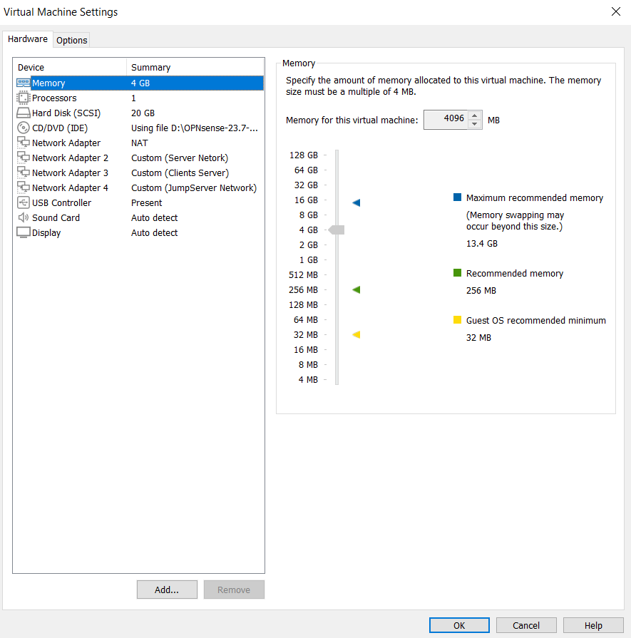

# Birinci 3 eded VMNET hazirlayiriq ve eger isteyirikse adlarini deyisdiririk

_Secdiyimiz VmNeti change settings deyerek subneti deyisirik *(Tapsirigda verdiyi kimi)*_

# Bundan Sonra ise OpnSense VM-ini yaradiriq,yaratdiqda default olaraq Nat adapteri qosulu olacaq,siz add network adapter deyerek sirasiyla yaratdiginiz servernet,clientnet ve jumpserverneti qosun

_Bu zaman Firewallunuzda 4 eded network adapter olacaq_

# Bundan sonra firewallu xodluyun ve !EM0 INTERFACE I WAN OLARAQ TEYIN EDIN,EM1 LAN,EM2 VE EM3 ISE SIRASIYLA OPT1 VE OPT2 OLACAQ!

